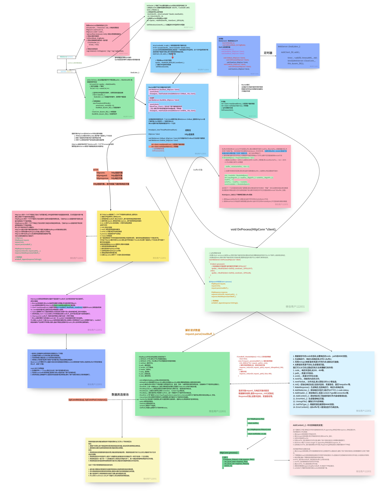

# WebServer
TinyWebServer利用Epoll与线程池模拟Proactor模式，实现对浏览器请求的解析与响应； 

在理解TinyWebServer的基础上实现部分性能的改进 

- 分别实现基于信号量和条件变量版本线程池，使用智能指针对Pool对象进行管理； 
- 利用标准库容器封装char,实现自动增长的缓存区； 
- 改进原有基于升序链表的定时器，采用小根堆实现，关闭超时的非活动连接；

## 项目架构理解


## 项目代码架构理解



## 环境要求

* Linux
* C++14
* MySql

## 目录树
```
.
├── code           源代码
│   ├── buffer
│   ├── config
│   ├── http
│   ├── log
│   ├── timer
│   ├── pool
│   ├── server
│   └── main.cpp
├── test           单元测试
│   ├── Makefile
│   └── test.cpp
├── resources      静态资源
│   ├── index.html
│   ├── image
│   ├── video
│   ├── js
│   └── css
├── bin            可执行文件
│   └── server
├── log            日志文件
├── webbench-1.5   压力测试
├── build          
│   └── Makefile
├── Makefile
├── LICENSE
└── readme.md
```


## 项目启动
需要先配置好对应的数据库
```bash
// 建立yourdb库
create database yourdb;

// 创建user表
USE yourdb;
CREATE TABLE user(
    username char(50) NULL,
    password char(50) NULL
)ENGINE=InnoDB;

// 添加数据
INSERT INTO user(username, password) VALUES('name', 'password');
```

```bash
make
./bin/MyWebServer
```
在浏览器输入：
http://服务器公网ip:9999/index.html

## 


